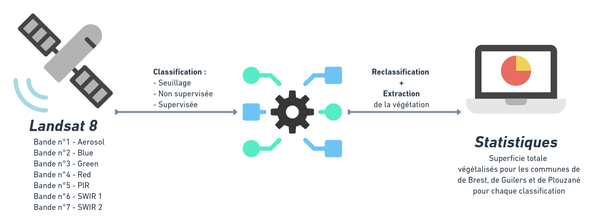

<style>
body {
text-align: justify}
</style>

```{r knitr_init, echo=FALSE, cache=FALSE, warning=FALSE}
library(knitr)
library(rmdformats)
library(kableExtra)
library(ggplot2)

## Global options
options(max.print="75")
opts_chunk$set(echo=FALSE,
               cache=TRUE,
               prompt=FALSE,
               tidy=TRUE,
               comment=NA,
               message=FALSE,
               warning=FALSE)
opts_knit$set(width=75)
```
_Travaux dirigés réalisés par Olivier Gillet et Yvette Vaguet_



L'objectif de l'exercice est de calculer la superficie totale (km²) des espaces végétalisés pour les communes de Brest, de Guilers et de Plouzané pour chaque classification pour le mois d'avril 2017.

### ***Etapes***  
- Classifier les images selon les trois méthodes de classification (seuillage, non supervisée et supervisée)  
- Reclassifier les rasters afin d'extraire la classe végétation pour chaque classification (calculatrice raster `r emo::ji("abacus")`ou algorithme   *reclassification* du plugin SCP `r emo::ji("computer")`)  
- Calculer les statistiques pour les communes de Brest, de Guilers et de Plouzané (selon l'une des deux méthodes QGIS ou selon le script R)  

### ***Données (Inputs)***  
- Image satellitaire Landsat 8 (raster, 5 bandes spectrales, EPSG::32630)  
- Donnée vectorielle des communes de Brest métropole (vecteur, polygone, EPSG::32630)  

### ***Résultats (Outputs)***  
- Trois histogrammes présentant la superficie totale (km²) des espaces végétalisés pour les communes d'analyse  
- Un diagramme de la chaîne de traitements  
- Un texte décrivant la chaîne de traitements et les statistiques  

`r emo::ji("warning")` Votre rendu doit faire deux pages maximum et est à déposer au plus tard le  `r emo::ji("date")` 17 décembre 2021 sur [Universitice](https://universitice.univ-rouen.fr) 

<center>
```{r echo=FALSE, message=FALSE, warning=FALSE, , echo=FALSE}
results <- data.frame(Commune=rep(c("Plouzané","Brest","Guilers"),3), 
                      methode=c(rep("Seuillage",3),rep("Non supervisée",3),rep("Supervisée",3)),
                      superficie=runif(9, 1, 5))
                      
                      
# results[,'superficie'] <- results[,'superficie']/1000
p <- ggplot2::ggplot(results, ggplot2::aes(x=Commune, y=superficie, fill=Commune)) +
  facet_grid(. ~ methode) +
  ggplot2::geom_bar(stat="identity")+
  ggplot2::labs(title = "Superficie des espaces végétalisés pour 3 communes",subtitle = "Avril 2017 - Landsat8 - Trois méthodes de classification", x="Commune", y="km²")+ 
  ggplot2::theme_minimal() +
  ggplot2::theme(axis.text.x = ggplot2::element_blank())+
  ggplot2::scale_fill_brewer(palette="Dark2")


print(p)
```
</center>