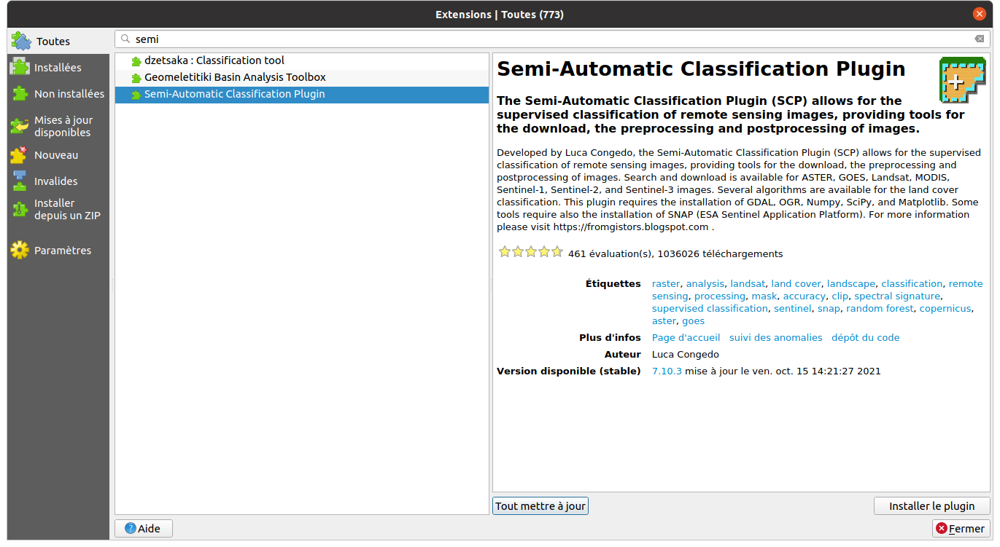

<style>
body {
text-align: justify}
</style>

```{r knitr_init, echo=FALSE, cache=FALSE, warning=FALSE}
library(knitr)
library(rmdformats)
library(kableExtra)

## Global options
options(max.print="75")
opts_chunk$set(echo=FALSE,
               cache=TRUE,
               prompt=FALSE,
               tidy=TRUE,
               comment=NA,
               message=FALSE,
               warning=FALSE)
opts_knit$set(width=75)
```
_Travaux dirigés réalisés par Olivier Gillet et Yvette Vaguet_

# Objectifs du TD n°1
- Télécharger, visualiser et explorer des données matricielles produites par le satellite Landsat 8
- Réaliser des signatures spectrales et des profils radiométriques

Le TD va se dérouler en 4 temps :  
1 - Télécharger les images satellitaires de l'embouchure de la Seine depuis le site de l'USGS  
2 - Prétraiter les données (Réaliser un layerStack et découper les données sous QGIS)  
3 - Visualiser les images sous QGIS (pseudo-couleur, le rehaussement d'image, les compositions colorées)  
4 - Réaliser des signatures spectrales ainsi que des profils radiométriques  

# **EarthExplorer** & **l'USGS**  

L'Institut d'études géologiques des États-Unis (United States Geological Survey, USGS) est un organisme gouvernemental américain qui se consacre aux sciences de la Terre. Par exemple, l'une des missions de l'organisme consiste à surveiller activité volcanique et sismique sur l'ensemble du globe.  L'USGS et le département de l'agriculture ont impulsé le premier programme spatial d'observation de la Terre destiné à des fins civiles, le programme landsat. Il sera développé au milieu des années 1960 par l'agence spatiale américaine, la NASA. L'USGS, département de l'Intérieur des États-Unis, met à disposition gratuitement pour le monde entier les données brutes étalonnées Landsat. L'organisme met également à disposition d'autres données comme des MNT, des données issues de capteurs actifs, ... La NASA a réalisé 6 lancements de satellites "Landsat" depuis les années 70 (9 satellites au total). Les données utilisées lors des TDs sont issues de la 5ème campagne avec le satellite Landsat 8. 


```{r}
df <- data.frame(
  # "Capteur"= c(rep("OLI", 9),rep("TIRS", 2)),
                 "Bandes"=c("Bande spectrale n°1 - aérosols","Bande spectrale n°2 - Bleu","Bande spectrale n°3 - Vert","Bande spectrale n°4 - Rouge","Bande spectrale n°5 - Proche Infrarouge","Bande spectrale n°6 - Moyen Infrarouge","Bande spectrale n°7 - Moyen Infrarouge","Bande spectrale n°8 - Panchromatique","Bande spectrale n°9 - Cirrus", "Bande spectrale n°10 - Infrarouge", "Bande spectrale n°11 - Infrarouge"),
                 "Longueur onde"=c("0.433 - 0.453 µm","0.450 - 0.515 µm","0.525 - 0.600 µm","0.630 - 0.680 µm","0.845 - 0.885 µm","1.560 - 1.660 µm","2.100 - 2.300 µm","0.500 - 0.680 µm","1.360 - 1.390 µm","10.30 - 11.30 µm", "11.50 - 12.50 µm"),
                 "Résolution"=c("30 m","30 m","30 m","30 m","30 m","30 m","30 m","15 m","30 m","100 m","100 m"))

kbl(df, col.names = NULL) %>%
  kable_paper(full_width = T) %>%
  column_spec(1, bold = T)  %>%
  pack_rows("Instrument embarqué n°1 - OLI", 1, 9, label_row_css = "background-color: #333333; color: #fff;")%>%
  pack_rows("Instrument embarqué n°2 - TIRS", 10, 11, label_row_css = "background-color: #333333; color: #fff;")
```

# 1 - Télécharger l'image Landsat `r emo::ji("artificial_satellite")`

1 - https://ers.cr.usgs.gov/login (l'inscription est obligatoire pour télécharger les données de l'USGS)  
`r emo::ji("warning")` Le formulaire d'inscription est long et en anglais.  
2 - https://earthexplorer.usgs.gov/ (lien vers la plateforme de données)  
3 - Télécharger les données depuis la plateforme

Vous devez télécharger l'image du nord Finistère acquise le 2017/08/28 (Landsat 8  OLI/TIRS C2 L1) et extraire les images.   


# 2 - Télécharger le plugin SAC et ProfilTool

QGIS n'est pas un logiciel de traitement d'images comme IDRISI ou ENVI. Pour explorer et/ou manipuler graphiquement des images satellitaires via le Système d'Information Géographique (SIG, QGIS), nous devons installer deux plugins "Semi-Automatic Classification" et "Profile Tool". Ce premier plugin open-source a été développé par Luca Congedo pour la classification semi-automatique (ou classification supervisée) des images satellitaires. L'outil est très complet car il fournit des outils de téléchargement, de pré/post traitements des images.  

Pour le télécharger, après ouverture du SIG QGIS, vous devez vous rendre sur la fenêtre "Installer/Gérer les extensions" et installer le plugin "Semi-Automatic Classification":  

> Extensions -> Installer/Gérer les extensions


*Congedo, L., (2021). Semi-Automatic Classification Plugin: A Python tool for the download and processing of remote sensing images in QGIS. Journal of Open Source Software, 6(64), 3172, https://doi.org/10.21105/joss.03172*  


# 3 - Grouper les bandes spectrales

La première étape du prétraitement consiste à regrouper les 11 bandes spectrales de l'image satellite. Nous devons réaliser une "LayerStack" des bandes. Il s'agit de grouper des diverses images en un seul objet (une image composée de plusieurs bandes). Une image de plusieurs bandes est plus facile à manipuler que plusieurs images d'une seule bande spectrale. Cela permet un gain de temps lorsque nous devons appliquer une chaîne de traitements sur les données matricielles.  

> Raster -> Divers -> Construire un rasteur virtuel  

`r emo::ji("warning")` N'oubliez pas de cocher l'option "Place each input file into a separate band"

Le fichier créé par l'outil est format *.vrt*. Exporter ce fichier dans un autre format, en *.tif*.  

> Clic droit sur l'image -> Exporter -> Enregistrer sous ...  

Votre image doit être composée de 11 bandes spectrales et projetée en WGS84 UTM 30n (EPSG:32630) `r emo::ji("globe")`

# 4 - Découper l'image satellite

Nous allons ensuite découper l'image satellite et définir la zone d'étude sur la ville de Brest et sa rade. Zoomez sur votre zone d'étude puis trouvez l'outil suivant :  

> Raster -> Extraire -> Découper un raster selon une emprise  

`r emo::ji("zoom")`  Choisissez l'option "Utilisez l'emprise du canevas de carte" dans "Etendue de découpage".  
`r emo::ji("warning")` Vous pouvez supprimer les deux couches précédentes afin de libérer de la mémoire (le fichier en .vrt et en .tif)


# 5 - Visualer l'image `r emo::ji("screen")`
### En niveau de gris

> Clic droit sur l'image -> Propriétés -> Symbologie  -> Type de rendu -> Bande grise unique

Sélectionnez la bande du Proche Infrarouge (bande  n°5) par exemple en niveau de gris.  

Vous pouvez afficher les valeurs de chaque pixel avec l'outil "Identifier des entités" (CTRL + MAJ + I). Vous dirigez ensuite votre curseur sur le canevas et cliquez sur un pixel quelconque pour obtenir sa valeur radiométrique sur toutes les bandes spectrales. Celles-ci varient en fonction de l'encodage de l'image (les valeurs varient entre 0 et 225 si l'image est codée sur 8 bits par exemple). On parle alors de *résolution radiométrique*. 

`r emo::ji("question")` Quelle est la résolution spatiale et radiométrique de votre image ? 

__Rappel__   

- Entre 0,3 à 3 µm, la signature spectrale correspond à la réflectance  
- Partie thermique du spectre (3 µm à quelques cm), la signature correspond à la température  


> Clic droit sur l'image -> Propriétés -> Histogramme 

Vous pouvez afficher l'histogramme de fréquence de votre image.  C'est une manière simple de visualiser du contenu des données et de la répartition des valeurs de réflectance ou d'émittance. L'axe horizontal représente les valeurs de pixels, donc ici les valeurs radiométriques. L'axe vertical représente la fréquence d'une valeur donnée.


Réalisez l'exercice suivante. Indiquez les valeurs radiométriques de chaque objet : 

```{r}
df <- data.frame("Objet"=c("Surface en eau", "Forêt", "Champ", "Bâtiment"),
                 "Coordonnées"=c("392072.7,5359053.6", "385242.57,5360070.59","399230.7,5364553.8","392349.9,5359921.0"),
                 "Bande.2"=c(rep("  ",4)),
                 "Bande.3"=c(rep("  ",4)),
                 "Bande.4"=c(rep("  ",4)),
                 "Bande.5"=c(rep("  ",4)),
                 "Bande.6"=c(rep("  ",4)),
                 "Bande.7"=c(rep("  ",4)))

kbl(df) %>%
  kable_paper(full_width = T) %>%
  column_spec(1, bold = T) 
```

### En pseudo-couleur (vraie/fausse couleur)
> Clic droit sur l'image -> Propriétés -> Symbologie  -> Type de rendu -> Couleurs à bandes multiples

`r emo::ji("question")` Selon vous, quelle est la combinaison des bandes spectrales pour afficher l'image en pseudo-couleur naturelle ? 


Maintenant, nous allons réaliser une composition en infrarouge colorée, ou fausses couleurs. Elle a pour objectif de faire apparaître la végétation.  

+ La bande 5 en rouge, la bande 4 en vert, la bande 3 en bleu (5R, 4V, 3B ou 5,4,3) 


`r emo::ji("question")` Selon vous, que signifie les couleurs de la composition ?

Vous pouvez essayer diverses compositions comme les suivantes:  

+ la bande 5 en rouge, la bande 4 en vert, la bande 2 en bleu (5R, 4V, 2B ou 5,4,2)  
+ la bande 5 en rouge, la bande 4 en vert, la bande 1 en bleu (5R, 4V, 1B ou 5,4,1)  
+ la bande 4 en rouge, la bande 3 en vert et la bande 1 en bleu (4R, 3V, 1B ou 4,3,1)  

# 6 - Les profils radiométriques `r emo::ji("stats")`

> Extensions -> Profile tool -> Terrain profil


`r emo::ji("question")` Exercice - Réalisez un seul graphique avec le profil radiométrique de la bande spectrale n°2,3,4,5 et 10.

# 7 - Les signatures spectrales `r emo::ji("stats")`

Chaque objet, à cause de leurs caractéristiques intrinsèques, possède sa propre réponse spectrale, signature spectrale (quantité d'énergie émise ou réfléchie en fonction de la longueur d'onde). Les objets peuvent être ainsi identifiés sur les images satellitaires grâce à leur signature spectrale. 


`r emo::ji("question")` Exercice - Tracez les différentes signatures spectrales sous Excel avec les données de votre précédent tableaux.