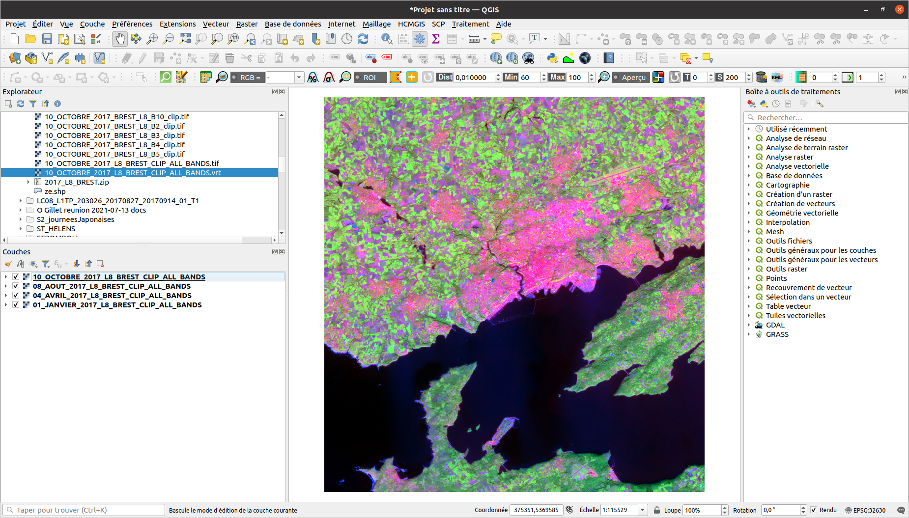
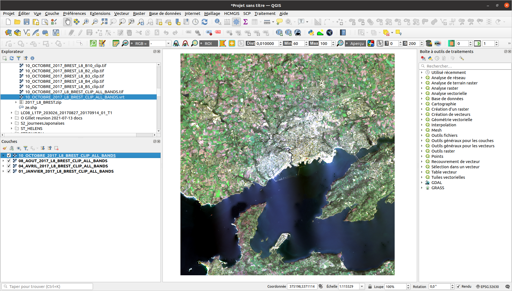
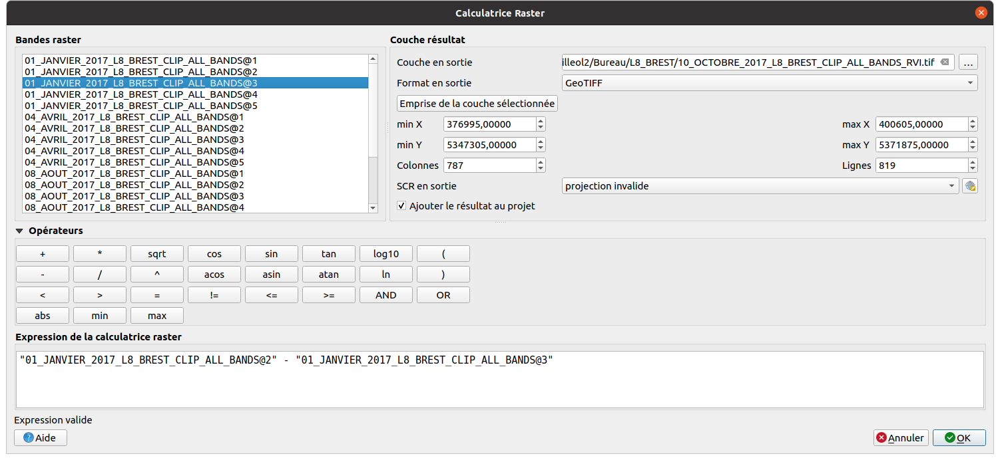
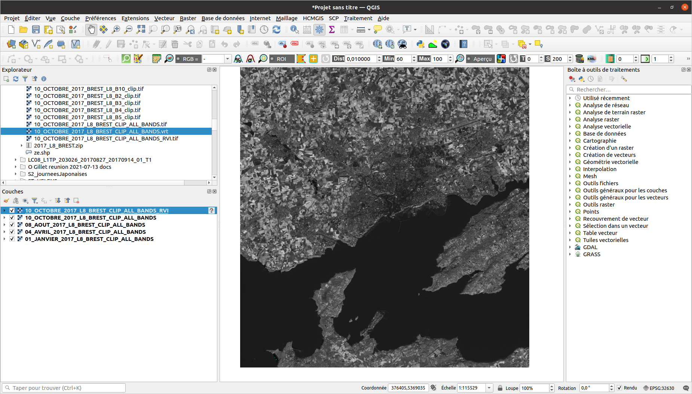
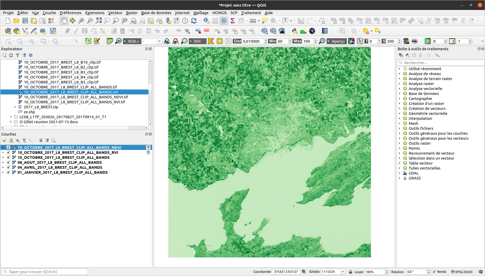
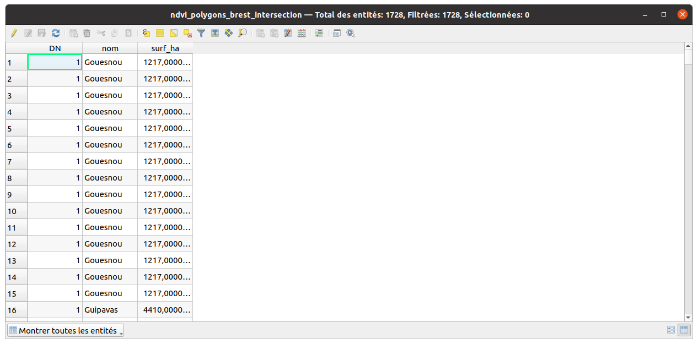

<style>
body {
text-align: justify}
</style>

```{r knitr_init, echo=FALSE, cache=FALSE, warning=FALSE}
library(knitr)
library(rmdformats)
library(kableExtra)

## Global options
options(max.print="75")
opts_chunk$set(echo=FALSE,
               cache=TRUE,
               prompt=FALSE,
               tidy=TRUE,
               comment=NA,
               message=FALSE,
               warning=FALSE)
opts_knit$set(width=75)
```
_Travaux dirigés réalisés par Olivier Gillet et Yvette Vaguet_

# Objectifs du TD n°2
- Apprendre à utiliser la calculatrice raster 
- Réaliser un début d'analyse diachronique sur la zone d'étude
- Faire le lien entre la théorie (signatures spectrales), les indicateurs et les cartographies thématiques

Le TD va se dérouler en 4 temps :  
1 - Télécharger les données sur la plateforme **Universitice**  
2 - Continuer de prétraiter les données (réaliser un layerStack pour chaque scène)   
3 - Visualiser les images sous QGIS  
4 - Calculer des indices (NDVI, BSI)  
5 - Exercices

# ***Prétraitements sous R***  

Ce bout de code R a pour objectif de découper toutes les images satellitaires de ce TD.  
`r emo::ji("warning")` C'est seulement un exemple pour illustrer les multiples avantages de la programmation en Géographie. 

```{r , echo=TRUE, eval=TRUE, message=FALSE, warning=FALSE}
start.time <- Sys.time()
for (d in c('01_JANVIER','04_AVRIL','08_AOUT','10_OCTOBRE')){
  setwd(paste0("/home/gilleol2/Bureau/L8_BREST/",d,"_2017_L8_BREST"))
  filesList <- list.files(pattern = ".TIF")
  ze = sf::st_read("/home/gilleol2/Bureau/L8_BREST/ze.shp", quiet=T)
  for(r in filesList){
    raster_best = raster::raster(r)
    raster_best_crop = raster::crop(raster_best,ze)
    raster::writeRaster(raster_best_crop,paste0(tools::file_path_sans_ext(r),'_clip.TIF'),
                        options=c('TFW=YES'),overwrite=TRUE)
  }
}
end.time <- Sys.time()
time.taken <- end.time - start.time
cat("Temps d'execution ==>",time.taken)
```

Au final, il me faut 5 minutes pour écrire le script R et 5 secondes pour découper 20 images satellitaires situées dans 4 répertoires différents. Ce prétraitement vous permet de manipuler des objets moins lourds pour votre machine.  

En plus du gain de temps, les avantages de la programmation en Géographie sont multiples :  
- Chaîne des traitements (simples ou complexes)  
- Automatisation de certaines tâches  
- Réexécution du code  
- Création de nouvelles fonctionnalités   
  
R comme Python permettent de s'affranchir des softs classiques (ArcGis, Grass, Qgis, GVSig, Idrisi, Erdas) et de réaliser des chaînes de traitements plus ou moins complexes sans SIG ou logiciel de traitement d’images en utilisant certaines librairies comme GDAL/OGR et autres ... Vous verrez cela en Master si vous continuez à Rouen `r emo::ji("student")`

# 1 - Télécharger les images Landsat `r emo::ji("artificial_satellite")`

Vous devez vous rendre sur [Universitice](https://universitice.univ-rouen.fr)  et télécharger le jeu de données à télécharger est le suivant :

> TD 2 - Donnees L8 (2017, 4 scènes)  

Le jeu de données est composé de plusieurs scènes Landsat 8, 4 scènes acquises en 2017. Vous disposez seulement de 5 bandes spectrales pour chaque scène.  

Pour rappel, les images satellitaires se caractérisent par une information panchromatique, multi- ou hyper-spectrales. Le nombre de bandes spectrales et les intervalles de longueur d’onde de ces dernières diffèrent selon le satellite et les capteurs utilisés. Les bandes spectrales à disposition sont les suivantes :  

```{r}
df <- data.frame(
  # "Capteur"= c(rep("OLI", 9),rep("TIRS", 2)),
                 "Bandes"=c("Bande spectrale n°2 - Bleu","Bande spectrale n°3 - Vert","Bande spectrale n°4 - Rouge","Bande spectrale n°5 - Infrarouge proche", "Bande spectrale n°10 - Infrarouge à grande longueur d'onde"),
                 "Longueur onde"=c("0.450 - 0.515 µm","0.525 - 0.600 µm","0.630 - 0.680 µm","0.845 - 0.885 µm", "10.30 - 11.30 µm"),
                 "Résolution"=c("30 m","30 m","30 m","30 m","100 m"))

kbl(df, col.names = NULL) %>%
  kable_paper(full_width = T) %>%
  column_spec(1, bold = T)  %>%
  pack_rows("Instrument embarqué n°1 - OLI", 1, 4, label_row_css = "background-color: #333333; color: #fff;")%>%
  pack_rows("Instrument embarqué n°2 - TIRS", 5, 5, label_row_css = "background-color: #333333; color: #fff;")
```

`r emo::ji("calendar")` Les dates d'acquisition des images satellitaires sont les suivantes :

- 22 janvier 2017  
- 21 avril 2017  
- 27 août 2017  
- 14 octobre 2017  

# 2 - "LayerStacker" chaque scène `r emo::ji("computer")`

Vous devez regrouper les 5 bandes spectrales de chaque scène, réaliser un "LayerStack" des bandes.  pour rappel, un objet de plusieurs bandes est plus facile à manipuler que plusieurs objets d'une seule bande spectrale.  

> Raster -> Divers -> Construire un rasteur virtuel  

`r emo::ji("warning")` N'oubliez pas de cocher l'option "Place each input file into a separate band"  
`r emo::ji("warning")` Faites attention à l'ordre des bandes spectrales lors de la création du vrt

Le fichier créé par l'outil est format *.vrt*. Exporter ce fichier dans un autre format, en *.tif*.  

> Clic droit sur l'image -> Exporter -> Enregistrer sous ...  

Vos scènes doivent avoir les noms suivants :

- 01_JANVIER_2017_L8_BREST_CLIP_ALL_BANDS  
- 04_AVRIL_2017_L8_BREST_CLIP_ALL_BANDS  
- 08_AOUT_2017_L8_BREST_CLIP_ALL_BANDS  
- 10_OCTOBRE_2017_L8_BREST_CLIP_ALL_BANDS  



# 3 - Visualiser l'image `r emo::ji("screen")`

## En pseudo-couleur (vraie couleur)
> Clic droit sur l'image -> Propriétés -> Symbologie  -> Type de rendu -> Couleurs à bandes multiples

Vous devez réaliser une composition colorée "vraies couleurs" pour chaque scène.

+ La bande 4 en rouge, la bande 3 en vert, la bande 2 en bleu (4R, 3V, 2B ou 4, 3, 2) 



# 4 - Calculer mon premier indice `r emo::ji("calculation")`

Les images satellitaires sont des images numériques que l'on peut exploiter à travers  des traitements statistiques ou mathématiques afin de calculer des indicateurs.
Le calcul de ces indicateurs est un processus impliquant la manipulation, via la calculatrice matricielle, d'une ou de plusieurs bandes spectrales. Ici, nous allons calculer, sur plusieurs images de la même région prises à des temporalités différentes (données multi-temporelles), divers indicateurs mathématiques. Ces indicateurs, issus de méthodes d'analyses statistiques et/ou des combinaisons arithmétiques de canaux/bandes spectrales, permettront de synthétiser ou d'extraire certaines caractéristiques peu visibles sur les canaux radiométriques d'origine, en variables thématiques ayant une réelle signification.

Nous commençons par calculer un indice élémentaire, le **RVI** ou le **Ration Vegetation Index** (Krieger et al., 1969), en calculant le rapport en deux bandes spectrales. La végétation réfléchit fortement dans le proche infrarouge et absorbe fortement dans la portion du rouge visible.  

$RVI = PIR/ROUGE$    

`r emo::ji("question")` Vous devez réaliser le rapport spectral entre les bandes spectrales du Rouge et PIR sur la zone d'étude pour chaque scène.  
 
> Raster -> Calculatrice Raster





`r emo::ji("chart")` Les valeurs supérieures à 1 correspondent à de la végétation avec une activité chlorophyllienne alors que les valeurs proches de 1 sont les surfaces en eau ou les sols nus ou... végétation en dormance (hiver).  

# 5 - Etude de la végétation `r emo::ji("evergreen_tree")`

**L'indice de végétation normalisé (Normalized Difference Vegetation Index)**  

$NDVI = (PIR-ROUGE)/(PIR+ROUGE)$   

- [0,+1[ Surfaces végétalisées avec activités chlorophyllienne
- [-1,0[ Surfaces en eau ou humide
- 0 Sols nus

Autres indices pour l'étude de la végétation: **WDVI (Weighted Difference Vegetation Index)**, **PVI (Perpendicular Vegetation Index)**, **SAVI (Soil-Adjusted Vegetation Index)** , **TSAVI (Tranformed Soil-Adjusted Vegetation Index)**, **EVI (Enhanced Vegetation Index)**

`r emo::ji("question")` Vous devez réaliser le calcul du NDVI sur la zone d'étude pour chaque scène.  

> Raster -> Calculatrice Raster  



# 6 - Etude des sols `r emo::ji("mountain")`

**L'indice de brillance (Brightnes Soil Index)**  

$BSI = \sqrt{(ROUGE^{2} + PIR^{2})}$   

Cet indice donne une information sur *"l'albédo"* des sols de la zone d'étude. Celui-ci caractérise, via le taux d'humidité des sols, le niveau de brillance pour chaque pixel. Nous pouvons ainsi déduire si une surface est humide ou sèche. Les valeurs de l'indice sont exprimées en pourcentage. Un pourcentage élevé indique une brillance forte. Par exemple, un sol labouré à une brillance moindre. 

Autres indices pour différencier les sols: **NDSI (Normalized Difference Soil Index)**, **Indice de cuirasse** (plus pertinent que BSI)

`r emo::ji("question")` Vous devez réaliser le calcul du BSI sur la zone d'étude pour chaque scène.  

> Raster -> Calculatrice Raster  


# 7 - Etude des surfaces hygrophiles `r emo::ji("earth")`

**Le Normalized Difference Water Index (NDWI)**  

$NDWI = (ROUGE-MIR)/(ROUGE+MIR)$ 

- Valeurs négatives (sols nus et non cultivés)  
- Valeurs positives (surfaces cultivées et/ou végétalisées)  
- valeurs maximales (surfaces en eau)  

`r emo::ji("warning")` Vous ne pouvez pas calculer cet indices, il vous manque la bande spectrale du MIR.  

Autres indices pour étudier les surfaces hygrophiles : **Indice d'irrigation**, **DWV (Difference Water Vegetation**

# 8 - Exercice n°1  `r emo::ji("stats")`

`r emo::ji("question")` Vous devez tracer la courbe présentant l'évolution d'un indicateur (NDVI) au cours de l'année 2017 et sur 5 points différents de la zone d'étude.


`r emo::ji("stats")` Voici un exemple de résultat attendu

```{r echo=TRUE, message=FALSE, warning=FALSE, , echo=FALSE}
df <- data.frame(Date=c(as.Date(c("01/22/2017","04/21/2017","08/27/2017","10/14/2017"), "%m/%d/%y"),as.Date(c("01/22/2017","04/21/2017","08/27/2017","10/14/2017"), "%m/%d/%y")),  
                 NDVI=c(0.413549,0.120044,0.1689345,0.123184,0.426546,0.555021,0.438939,0.450983),
                 POINT=c(rep("POINT 1",4),rep("POINT 2",4)))
p <- ggplot2::ggplot(df, ggplot2::aes(x = Date, y = NDVI, group=POINT))

p <- p + ggplot2::geom_line(ggplot2::aes(color = POINT))+
    ggplot2::geom_point(ggplot2::aes(color = POINT)) +
    ggplot2::scale_color_manual(name="",values=c("#999999", "#E69F00"))+
    ggplot2::labs(title = "Evolution du NDVI au cours de l'année 2017", x="Date", y="Indice de végétation normalisé (NDVI)")+ 
    ggplot2::ylim(0, 1) 
print(p)
```

# 9 - Exercice n°2  `r emo::ji("stats")`

`r emo::ji("question")` Vous devez calculer la proportion d'espaces verts pout le mois d'octobre et les 8 communes de la zone d'étude.

# ***Calcul de la superficie des espaces végétalisés par commune sous QGIS*** 

1 - Tout d'abord, vous devez ajouter le shapefile *"communes_brest.shp"* dans votre projet QGIS.


2 - Ensuite, vous devez classifier, via la calculatrice raster, le NDVI à partir d'un seuillage NDVI.

`r emo::ji("question")` Selon vous, quel est le seuil végétation/sol nus (vous pouvez vous aider d'une composition colorée ou d'un fond satellite) ?

Formule pour classifier les NDVI à partir de la calculatrice raster   
$NDVI RECLASSIFY = (NDVI@1 < Seuil) * 0 + (NDVI@1 >= Seuil) * 1$ 


3 - Vous devez vectoriser votre raster puis supprimer les entités dont l'attribut "DN" est égal à 0 pour obtenir seulement des polygones de végétation.   
4 - Une intersection entre votre "rasteur vectorisé" et le shapefile des communes de Brest Métropole est nécessaire pour obtenir les statistiques.   



5 - Pour terminer, vous devez créer un champ avec la superficie des espaces végatalisés pour chaque commune

Formule pour calculer la superficie des espaces végétalisés à partir de la calculatrice de champ  
$Superficie  = sum( area ,  nom ) / 1000000$ 


# ***Calcul de la superficie des espaces végétalisés par commune sous R*** 

```{r eval=F, echo=T}
#  install.packages("tidyverse", type='win.binary')
#  install.packages("raster", type='win.binary')
#  install.packages("sf", type='win.binary')

# Load packages
library(raster)
library(sf)
library(ggplot2)

# Ouvrir le raster
raster_brest_reclassify = raster::raster("/home/gilleol2/Bureau/L8_BREST/10_OCTOBRE_2017_L8_BREST_CLIP_ALL_BANDS_NDVI_RECLASSIFY.tif")

# Ouvrir le shapefile des communes
communes = sf::st_read("/home/gilleol2/Bureau/L8_BREST/communes_brest.shp")

# Decouper le raster avec le shapefile
raster_brest_reclassify = mask(raster_brest_reclassify, communes)

# Convertir le raster en shapefile (polygones)
vector_brest_reclassify = rasterToPolygons(raster_brest_reclassify)
vector_brest_reclassify = st_as_sf(vector_brest_reclassify)

# Renommer une colonne
names(vector_brest_reclassify)[1] <- 'vegetation'

# Selectionner les polygones avec des espaces vegetalises
vector_brest_reclassify = vector_brest_reclassify[vector_brest_reclassify$vegetation!=1,]

# Realiser une intersection avec le shapefile des communes
vector_brest_reclassify = st_intersection(vector_brest_reclassify,communes)

# Calculer la superficie des surfaces vegetalises
vector_brest_reclassify[,'area'] <- as.numeric(st_area(vector_brest_reclassify))

# Calculer une statistique (Superficie des espaces végétalisés par commune)
results <- aggregate(vector_brest_reclassify$area, by=list(communes=vector_brest_reclassify$nom), FUN=sum)
colnames(results) <- c('communes','superficie')
results[,'superficie'] <- results[,'superficie']/1000

```
  
  
`r emo::ji("stats")` Voici un exemple de résultat attendu  

  
```{r echo=FALSE, message=FALSE, warning=FALSE, , echo=FALSE}
load('results.RData')
p <- ggplot2::ggplot(results, ggplot2::aes(x=communes, y=superficie, fill=communes)) +
  ggplot2::geom_bar(stat="identity")+
  ggplot2::labs(title = "Superficie des espaces végétalisés par commune",subtitle = "10 octobre 2017 - Seuil fixé à 0.5", x="Commune", y="Pourcentage (%)")+ 
  ggplot2::theme_minimal() +
  ggplot2::theme(axis.text.x = ggplot2::element_blank())+
  ggplot2::scale_fill_brewer(palette="Dark2")
print(p)
```
