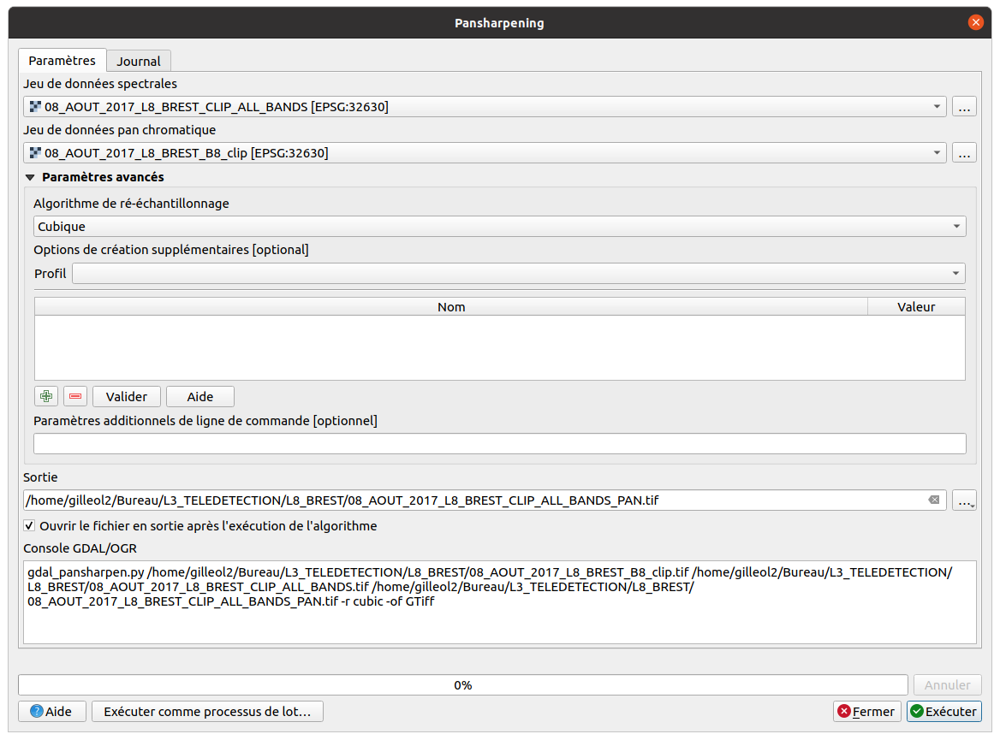

<style>
body {
text-align: justify}
</style>

```{r knitr_init, echo=FALSE, cache=FALSE, warning=FALSE}
library(knitr)
library(rmdformats)
library(kableExtra)

## Global options
options(max.print="75")
opts_chunk$set(echo=FALSE,
               cache=TRUE,
               prompt=FALSE,
               tidy=TRUE,
               comment=NA,
               message=FALSE,
               warning=FALSE)
opts_knit$set(width=75)
```
_Travaux dirigés réalisés par Olivier Gillet et Yvette Vaguet_

# Objectifs du TD n°3
- Manipuler des images produites par un satellite géostationnaire  
- Réaliser une fusion d'images satellitaires  

Le TD va se dérouler en 4 temps :   
1 - Télécharger les données sur la plateforme **Universitice**    
2 - Faire une composition colorée **"vraies couleurs"** puis exporter les PNGs via QGIS pour faire un gif  
3 - Réaliser une fusion d'images satellitaires par la méthode du **pan-sharpening**   

# **Météosat Seconde Génération (MSG)** 

**Mission principale** ➔ Prévision météorologique  
**Missions secondaires** ➔ Surveillance du climat et de l'environnement.  
  
C'est la composante européenne du système de surveillance météorologique mondiale développée par l’Organisation Météorologique Mondiale (OMM) depuis les années 1970.Ce système de surveillance  météorologique mondiale  est composé de plusieurs satellites géostationnaires déployés le long de l'équateur et permettent d'assurer un suivi météorologique global de la planète Quatre satellites, de MSG-1 à MSG-4, qui, ont été lancés à tour de rôle pour acquérir des images satellitaires des systèmes nuageux, de jour comme de nuit, pour permettre aux météorologues d'effectuer les prévisions quotidiennement.

**Applications** :  
- Hydrologie & précipitations  
- Agriculture 
- Évolution de l'urbanisation des terres émergées  
- Suivi  des températures de surface des océans  
- Ressource halieutique   
- Suivi des phénomènes éruptifs, mouvement des panaches de cendre   
- Évolution du couvert végétal   
- Les sécheresses   
- Détection des incendies de forêts  
- Émergence des épidémies par le suivi des nuages de poussières  
- ...


### 1 - Télécharger les images MSG `r emo::ji("artificial_satellite")`

Vous devez vous rendre sur [Universitice](https://universitice.univ-rouen.fr)  et télécharger le jeu de données à télécharger est le suivant :

> TD 3 - Donnees MSG (2020, 5 scènes)  

Le jeu de données est composé de plusieurs scènes  MSG-4, 5 scènes acquises en 2020 Vous disposez seulement de 11 bandes spectrales pour chaque scène.  

Pour rappel, les images satellitaires se caractérisent par une information panchromatique, multi- ou hyper-spectrales. Le nombre de bandes spectrales et les intervalles de longueur d’onde de ces dernières diffèrent selon le satellite et les capteurs utilisés. Les bandes spectrales à disposition sont les suivantes :

```{r}
df <- data.frame(
  # "n° canal"=c(1:12),
  "Bande spectrale"=c("Bande spectrale","VIS0.6","VIS0.8","PIR1.6","IR3.9","WV6.2","WV7.3","IR8.9","IR9.7","IR10.8","IR12.0","IR13.4","HRV"),
  "λmin" = c("λmin",0.56,0.74,1.50,3.48,5.35,6.85,8.30,9.38,9.80,11.0,12.40,0.4),
  "λ" = c("λ",0.635,0.81,1.64,3.90,6.25,7.35,8.70,9.66,10.80,12.00,13.40,0.55),
  "λmax" = c("λmax",0.71,0.88,1.78,4.36,7.15,7.85,9.10,9.94,11.80,13.0,13.40,1.1),
  "Résolution"=c("Résolution",paste0(rep(3,11),' km'),"1 km"),
  "Utilisaions"=c("Application","Détection et suivi des masses nuageuses, étude des terres émergées","Détection et suivi des masses nuageuses, étude des terres émergées","Distinction nuages d'eau et de glace, distinction neige / nuages chargés d'eau", "Détection des nuages bas et brouillards nocturnes, températures de surface, incendies de forêts","Mesure de la vapeur d'eau dans la haute troposphère, instabilités atmosphériques et vents locaux","Mesure de la vapeur d'eau dans la moyenne troposphère, instabilités atmosphériques et vents locaux","Détection des cirrus, instabilités atmosphériques", "Mesure de l'ozone", "Détection des nuages, températures des surfaces terrestres et océaniques, instabilités atmosphériques", "Détection des nuages, températures des surfaces terrestres et océaniques, instabilités atmosphériques","Détermination de la hauteur des cirrus, instabilités atmosphériques", "Détection et suivi des masses nuageuses, étude des terres émergées")
)

kbl(df, col.names = NULL) %>%
  kable_paper(full_width = T) %>%
  column_spec(1, bold = T)  %>%
  pack_rows("Caractéristiques MSG", 1, 9, label_row_css = "background-color: #333333; color: #fff;")
```

`r emo::ji("computer")` Lien pour à la plate-forme de données MSG et autres :  

https://pics.eumetsat.int/viewer/index.html  
https://view.eumetsat.int/productviewer?v=default   


`r emo::ji("calendar")` Les dates d'acquisition des images satellitaires sont les suivantes :  

- 20 octobre 2020 08h42  
- 20 octobre 2020 09h42  
- 20 octobre 2020 10h42  
- 20 octobre 2020 11h42  
- 20 octobre 2020 12h42   

### 2 - Visualiser les images `r emo::ji("screen")`
  


`r emo::ji("question")` Vous devez réaliser une **"composition colorée naturelle"** (Rouge:3, Vert:2, Bleu:1) pour chaque scène en faire un gif.
`r emo::ji("computer")` Lien pour à la plate-forme de données MSG et autres : https://ezgif.com/maker


La composition colorée combine la bande spectrale du visible (0.6 μm), du PIR (0.8 μm) et de l'IR (10.8 μm). Le canal de l'IR mesure les températures radiatives aux sommets des nuages. Les niveaux de gris, pour cette bande, représentent le rayonnement infrarouge émis par les nuages et la terre (plus c'est sombre, plus c'est chaud). Nous avons ainsi des informations relatives à l'altitude des nuages. La bande du visible fournit une information sur l'épaisseur optique des nuages. Les nuances de gris représentent l'intensité de la réflexion solaire. Plus les nuages sont épais, plus ils apparaissent en blanc. Pour finir, la bande du PIR fournit une information sur la végétation.  

• Nuage de glace (haute altitude) et neige en cyan.  
• Nuage d'eau (basse altitude) en blanc.  

# **Landsat 8 (L8)** `r emo::ji("artificial_satellite")`  
### La fusion  d'images satellitaires 

`r emo::ji("question")` Qu'est-ce qu'une fusion d'images ?

La définition sur [**wikipedia**](https://en.wikipedia.org/wiki/Pansharpened_image):  

>Pansharpening is a process of merging high-resolution panchromatic and lower resolution multispectral imagery to create a single high-resolution color image. Google Maps and nearly every map creating company use this technique to increase image quality. Pansharpening produces a high-resolution color image from three, four or more low-resolution multispectral satellite bands plus a corresponding high-resolution panchromatic band:

L'objectif est d'obtenir une information de meilleure qualité spatiale et spectrale en combinant de plusieurs images provenant de capteurs différents. Les
méthodes sont nombreuses (Gram-Schmidt, Brovey, ACP, CN Spectral Sharpening) mais le principe reste le même: intégrer le canal le plus précis spatialement et le moins précis spectralement (Panchromatique) dans les canaux multispectraux.


Voici deux images satellitaires de notre zone d'étude, l'une provient du satellite Sentinel-2 et l'autre de Landsat 8. Celle de gauche, issue du satellite Sentinel-2 à une meilleure résolution spatiale (10 m).  

>L'ESA, via le programme Sentinel, vise à déployer toute une série de satellites d'observation de la Terre (les premiers lancements ont eu lieu en 2015 et 2017). Le principal objectif du programme est de fournir aux pays européens des données complètes et actualisées leur permettant d'assurer le contrôle et la surveillance de l'environnement.  

L'image de droite est une image Landsat 8 avec une résolution spatiale de 30 mètres. La résolution spectrale des deux scènes est *"""globalement"""* similaire.    


Notre jeu de données Landsat 8 a cependant une bande spectrale dont la résolution spatiale est de 15 mètre, la **bande spectrale n°8 - Panchromatique**.  

L'objectif est donc de fusionner la **bande spectrale n°8 - Panchromatique** avec les autres bandes (**bande spectrale n°2 - Bleu, bande spectrale n°3 - Vert, bande spectrale n°4 - Rouge, bande spectrale n°5 - Infrarouge proche**)  

### **Étapes pour fusionner les images**

`r emo::ji("question")` 1 - Vous devez réaliser un layerstack des images du **22 janvier 2017**  & **27 août 2017**.  
`r emo::ji("question")` 2 - Vous devez télécharger les **bandes spectrales n°8 - Panchromatique du 22 janvier 2017  & 27 août 2017** sur la plateforme [Universitice](https://universitice.univ-rouen.fr).  

> TD 3 - Donnees L8 (2017, 2 bandes panchromatiques)  

`r emo::ji("question")` 3 - Vous devez réaliser une fusion du layerstack et de la **bande spectrale n°8 - Panchromatique**, objectif est de faire une composition colorée "vraies ou fausses couleurs" des scènes Landsat avec une résolution spatiale de  15 mètres.  

La première dans ce processus consiste à ouvrir les images (layerstack + bande spectrale du panchromatique) et de chercher l'algorithme **pan-sharpening** dans QGIS.  


  
L'étape consiste simplement à renseigner les images à forte spatiale et spectrale. Vous pouvez également modifier paramétrer des algorithmes de ré-échantillonnage ainsi que ceux pour la compression de données.  


Le résultat de la fusion de type **"pan-sharpening"** est le suivant :  
`r emo::ji("question")` Où se trouve les informations/métadonnées de mon image matricielle ? Est-ce que la résolution spatiale de mon raster est correcte ?    


`r emo::ji("question")` Vous devez réaliser la fusion **"pan-sharpening"** pour la scène de janvier 2017.    

# ***Fusion sous R***  

```{r eval=F, echo=T}
# # install.packages("tidyverse", type='win.binary')

# Load packages
library(raster)
library(rgdal)
library(ggplot2)
library(RStoolbox)

setwd(".")

# Load Landsat images
pan <- raster("01_JANVIER_2017_L8_BREST_B8_clip.tif")
b1 <- raster("01_JANVIER_2017_L8_BREST_CLIP_ALL_BANDS.tif",band=1)
b2 <- raster("01_JANVIER_2017_L8_BREST_CLIP_ALL_BANDS.tif",band=2)
b3 <- raster("01_JANVIER_2017_L8_BREST_CLIP_ALL_BANDS.tif",band=3)

multi <- stack(b1,b2,b3)
names(multi) <- c('red', 'green', 'blue')

## Brovey pan sharpening
lowResImg_pan <- panSharpen(multi, pan, r = 3, g = 2, b = 1, method = "brovey")
lowResImg_pan

## Plot
ggRGB(multi, stretch = "lin") + ggtitle("Original")
ggRGB(lowResImg_pan, stretch="lin") + ggtitle("Pansharpened (Brovey)")

writeRaster(lowResImg_pan, "01_JANVIER_2017_L8_BREST_CLIP_ALL_BANDS_pan.tif")
```