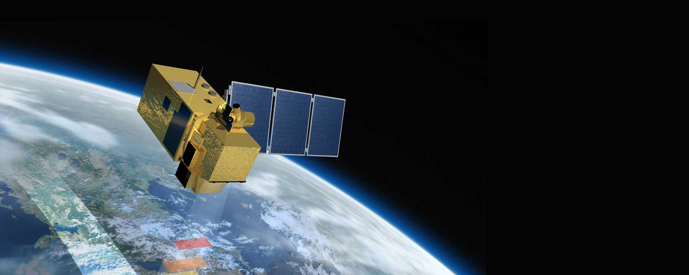
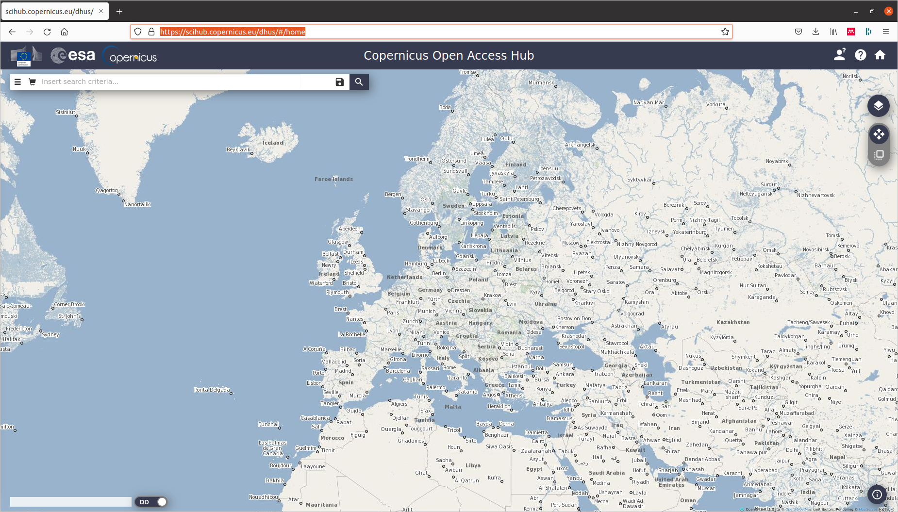
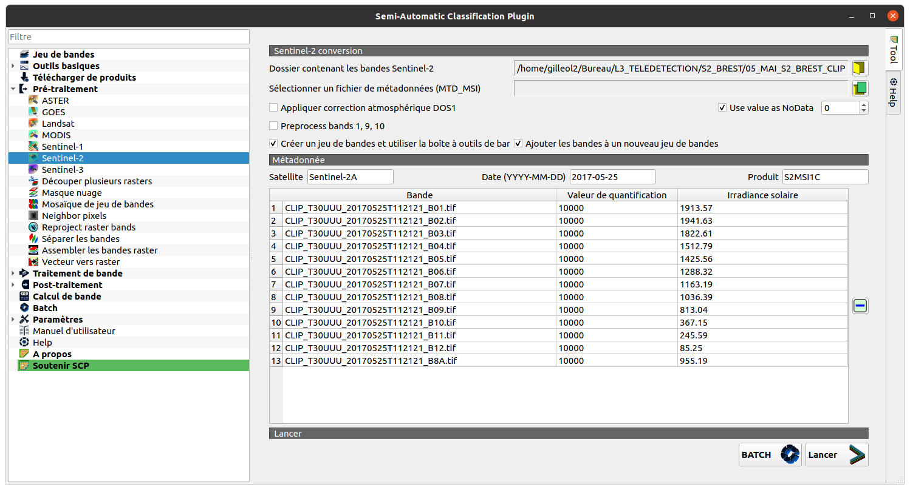
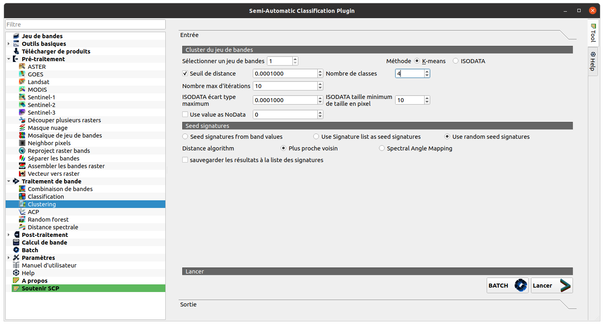
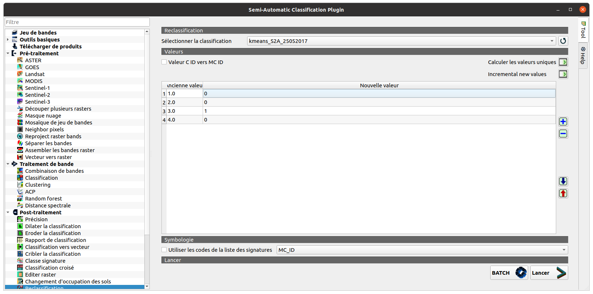
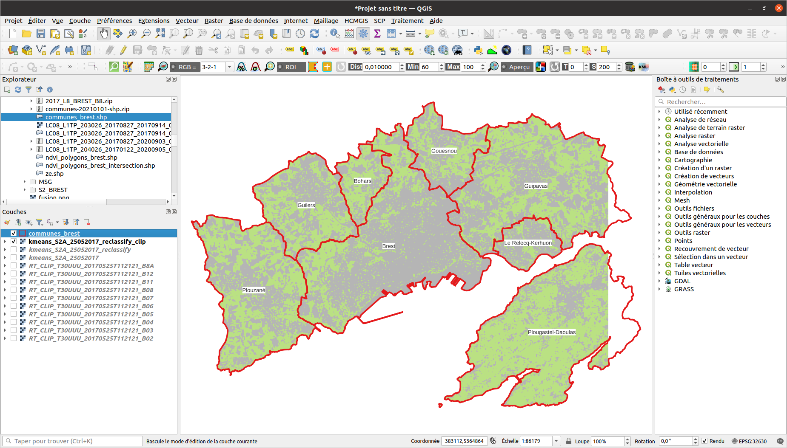

<style>
body {
text-align: justify}
</style>

```{r knitr_init, echo=FALSE, cache=FALSE, warning=FALSE}
library(knitr)
library(rmdformats)
library(kableExtra)

## Global options
options(max.print="75")
opts_chunk$set(echo=FALSE,
               cache=TRUE,
               prompt=FALSE,
               tidy=TRUE,
               comment=NA,
               message=FALSE,
               warning=FALSE)
opts_knit$set(width=75)
```
_Travaux dirigés réalisés par Olivier Gillet et Yvette Vaguet_

# Objectifs du TD n°4
- Apprendre à classifier des images satellitaires selon une approche non supervisée et comprendre le fonctionnement d'une classification automatique.
- Réaliser une cartographie et quelques statistiques des résultats  

Le TD va se dérouler en 3 temps :   
1 - Télécharger les données Sentinel-2 sur la plateforme **Universitice**   
2 - Classifier selon une méthode non supervisée des images satellitaires via le plugin SAC  
3 - Cartographier et analyser les résultats  

# **Sentinel-2 (S2)** 

L'ESA, via le programme Sentinel, vise à déployer toute une série de satellites d'observation de la Terre (les premiers lancements ont eu lieu en 2015 et 2017). Le principal objectif du programme est de fournir aux pays européens des données complètes et actualisées leur permettant d'assurer le contrôle et la surveillance de l'environnement.  



### 1 - Télécharger les images S2-A  `r emo::ji("artificial_satellite")`

Vous devez vous rendre sur [Universitice](https://universitice.univ-rouen.fr)  et télécharger le jeu de données à télécharger est le suivant :

> TD 4 - Donnees S2-A (2017, 14 bandes spectrales)  

Le jeu de données est composé d'une seule scène et vous disposez de l'ensemble des bandes spectrales.   

Pour rappel, les images satellitaires se caractérisent par une information panchromatique, multi- ou hyper-spectrales. Le nombre de bandes spectrales et les intervalles de longueur d’onde de ces dernières diffèrent selon le satellite et les capteurs utilisés. Les bandes spectrales à disposition sont les suivantes :

```{r}
df <- data.frame(
  # "Capteur"= c(rep("OLI", 9),rep("TIRS", 2)),
                 "Bandes"=c("Bande spectrale n°1 - Aérosol côtier",
                            "Bande spectrale n°2 - Bleu",
                            "Bande spectrale n°3 - Vert",
                            "Bande spectrale n°4 - Rouge",
                            "Bande spectrale n°5 - Végétation red edge",
                            "Bande spectrale n°6 - Végétation red edge",
                            "Bande spectrale n°7 - Végétation red edge",
                            "Bande spectrale n°8 - PIR",
                            "Bande spectrale n°8A – PIR étroit" , 
                            "Bande spectrale n°9 - Vapeur d'eau", 
                            "Bande spectrale n°10 - SWIR – Cirrus", 
                            "Bande spectrale n°11 - SWIR", 
                            "Bande spectrale n°12 - SWIR"),
                 "Longueur onde centrale"=c("442.7 nm",
                                            "492.4 nm",
                                            "559.8 nm",
                                            "664.6 nm",
                                            "704.1 nm",
                                            "740.5 nm",
                                            "782.8 nm",
                                            "832.8 nm",
                                            "864.7 nm",
                                            "945.1 nm",
                                            "1373.5 nm",
                                            "1613.7 nm",
                                            "2202.4 nm"),
                 "Résolution"=c("60 m",
                                rep("10 m",3),
                                rep("20 m",3),
                                "10 m",
                                "20 m",
                                rep("60 m",2),
                                rep("20 m",2)
                                ))

kbl(df, col.names = NULL) %>%
  kable_paper(full_width = T) %>%
  column_spec(1, bold = T)  %>%
  pack_rows("Caractéristiques S2-A", 1, 13, label_row_css = "background-color: #333333; color: #fff;")
```

`r emo::ji("computer")` Lien pour à la plate-forme de données MSG et autres :  

https://scihub.copernicus.eu/dhus/#/home
https://earthexplorer.usgs.gov/



`r emo::ji("calendar")` La date d'acquisition de l'images satellitaire est la suivante :  

- 25 mai 2017 11h21  

`r emo::ji("question")` Quelle est la résolution spatiale de mes images ?

### 2 - Télécharger le plugin SAC et ProfilTool

QGIS n'est pas un logiciel de traitement d'images comme IDRISI ou ENVI. Pour classifier graphiquement des images satellitaires via le Système d'Information Géographique (SIG, QGIS), nous devons installer un plugin "Semi-Automatic Classification". Ce premier plugin open-source a été développé par Luca Congedo pour la classifier des images satellitaires. L'outil est très complet car il fournit des outils de téléchargement, de pré/post traitements des images.  

Pour le télécharger, après ouverture du SIG QGIS, vous devez vous rendre sur la fenêtre "Installer/Gérer les extensions" et installer le plugin "Semi-Automatic Classification":  

> Extensions -> Installer/Gérer les extensions


### 3 - Créer un jeu de données depuis le plugin

> SCP -> Pré-traitement -> Sentinel-2



L'algorithme de pré-traitement des données affiche les bandes spectrales dans QGIS après son exécution. Vous pouvez également réaliser des compositions colorées "vraies et fausses" couleurs directement dans la barre d'outils.

.png)

# **Les algorithmes de classification non supervisées **

La classification, manuelle ou automatique, a pour objectif d'assigner une classe particulière à chacun des pixels d'une scène (surface en eau, surface végétalisée ou sol nu par exemple). Cette classification, ou typologie, est une mosaïque de pixels qui appartiennent chacun à une classe d'occupation du sols. Celle-ci peut être plus ou moins complexe (nombre de classe, caractérisation des objets observés, ..).

Pour rappel, les images satellitaires sont des images numériques que l'on peut exploiter à travers des traitements statistiques et/ou mathématiques afin de calculer des indicateurs ou de les classifier. Tous pixel sont caractérisés par un vecteur de valeur numérique. La longueur de se vecteur dépend du nombre de bandes spectrales de l'image. Ainsi, et en fonction des vecteurs de valeurs, des groupes de pixels qui ont les mêmes caractéristiques (ou presque) peuvent être classé dans une **classe d'information**. Les pixels réunis au sein de ces différentes classes d'une typologie ont des caractéristiques radiométriques communes et correspondant donc à des objets géographiques similaires ou très proches.

On parle de **partitionnement de données** ou de **clustering**.

La définition sur [**wikipedia**](https://fr.wikipedia.org/wiki/Partitionnement_de_donn%C3%A9es):  

> Le partitionnement de données (ou data clustering en anglais) est une méthode en analyse des données. Elle vise à diviser un ensemble de données en différents « paquets » homogènes, en ce sens que les données de chaque sous-ensemble partagent des caractéristiques communes, [..]. Pour obtenir un bon partitionnement, il convient d'à la fois :
>
>   - minimiser l'inertie intra-classe pour obtenir des grappes (cluster en anglais) les plus homogènes possibles ;
>   - maximiser l'inertie inter-classe afin d'obtenir des sous-ensembles bien différenciés.

Ces algorithmes (isodata ou kmeans par exemple) se basent sur la distance mathématique entre les entités/pixels/individus d'un jeu de données dans un espace à N dimension afin de les classer. 

# **Algorithme Kmeans**
`r emo::ji("warning")` Rappel CM de Mme Vaguet.

- Données en entrée : n points placés dans un référentiel en d dimensions  
    Où **n = nombre de pixels dans l’image**  
       **d = nombre de bandes spectrales utilisées**  
       
- Placement aléatoire de x centroïdes dans le référentiel  
   Où **x = nombre de classes**, défini par l’opérateur  
   
- On associe à chaque point le centroïde le plus proche. Cette opération forme des clusters.  

- On calcule le centre de gravité de chaque cluster.  

- Pour chaque cluster, on déplace le centroïde sur le centre de gravité.  

- On recalcule les distances entre les points et leur centroïde le plus proche.  
  On recalcule le centre de gravité de chaque cluster.   
  On déplace le centroïde des clusters vers leur centre de gravité.  

- Et ainsi de suite jusqu’à ce que la position du centroïde soit égale à la position du centre de gravité du cluster.

<center>  


  
</center>  
 
### 1 - Réaliser la classification sous QGIS

> SCP -> Traitement de bande -> Clustering  

`r emo::ji("warning")` Vous devez fixer trois paramètres avant d'exécuter l'algorithme :  
  
- le nombre d'itérations  
- le nombre de classes  
- et la condition d'arrêt (non obligatoire)   

Pour la première exécution, laissez les paramètres par défaut.



.png)

### 2 - Reclassifier le raster afin d'extraire les surfaces végétatlisées puis découper le raster.

Vous avez deux outils à votre disposition pour classifier à nouveau les rasters :  
  
- la calculatrice raster (cf. TD2)  
- l'outil du plugin, **l'outil "reclassification"**  
  
> SCP -> Post-traitement -> reclassification



 

### 3 - Calcul de la superficie des espaces végétalisés par commune 

```{r eval=FALSE, include=FALSE}
# Load packages
library(raster)
library(sf)
library(ggplot2)

# Ouvrir le raster
raster_brest_reclassify = raster::raster("/home/gilleol2/Bureau/L3_TELEDETECTION/S2_BREST/05_MAI_S2_BREST_CLIP/converted/kmeans_S2A_25052017_reclassify.tif")

# Ouvrir le shapefile des communes
communes = sf::st_read("/home/gilleol2/Bureau/L8_BREST/communes_brest.shp")

# Reprojeter le raster
raster_brest_reclassify = projectRaster(raster_brest_reclassify,crs = crs(communes))

# Decouper le raster avec le shapefile
raster_brest_reclassify = mask(raster_brest_reclassify, communes)

# Convertir le raster en shapefile (polygones)
vector_brest_reclassify = rasterToPolygons(raster_brest_reclassify)
vector_brest_reclassify = st_as_sf(vector_brest_reclassify)

# Renommer une colonne
names(vector_brest_reclassify)[1] <- 'vegetation'

# Selectionner les polygones avec des espaces vegetalises
vector_brest_reclassify = vector_brest_reclassify[vector_brest_reclassify$vegetation!=1,]

# Realiser une intersection avec le shapefile des communes
vector_brest_reclassify = st_intersection(vector_brest_reclassify,communes)

# Calculer la superficie des surfaces vegetalises
vector_brest_reclassify[,'area'] <- as.numeric(st_area(vector_brest_reclassify))

# Calculer une statistique (Superficie des espaces végétalisés par commune)
results <- aggregate(vector_brest_reclassify$area, by=list(communes=vector_brest_reclassify$nom), FUN=sum)

# Renommer les colonnes
colnames(results) <- c('communes','superficie')

# Convertir m2 en km2
results[,'superficie'] <- results[,'superficie']/1000000
save(results,file='results_td4.RData')

```
  
`r emo::ji("stats")` Voici un exemple de résultat attendu  
  
```{r echo=FALSE, message=FALSE, warning=FALSE, , echo=FALSE}
load('results_td4.RData')
p <- ggplot2::ggplot(results, ggplot2::aes(x=communes, y=superficie, fill=communes)) +
  ggplot2::geom_bar(stat="identity")+
  ggplot2::labs(title = "Superficie des espaces végétalisés par commune",subtitle = "10 octobre 2017 - Algorithme Kmeans", x="Commune", y="km2")+ 
  ggplot2::theme_minimal() +
  ggplot2::theme(axis.text.x = ggplot2::element_blank())+
  ggplot2::scale_fill_brewer(palette="Dark2")
print(p)
```

`r emo::ji("question")` Vous devez réaliser la classification Kmeans pour les images `r emo::ji("artificial_satellite")`