<style>
body {
text-align: justify}
</style>

```{r knitr_init, echo=FALSE, cache=FALSE, warning=FALSE}
library(knitr)
library(rmdformats)
library(kableExtra)

## Global options
options(max.print="75")
opts_chunk$set(echo=FALSE,
               cache=TRUE,
               prompt=FALSE,
               tidy=TRUE,
               comment=NA,
               message=FALSE,
               warning=FALSE)
opts_knit$set(width=75)
```
_Travaux dirigés réalisés par Olivier Gillet et Yvette Vaguet_

# Objectifs du TD n°5
- Apprendre à classifier des images satellitaires selon une approche supervisée et comprendre le fonctionnement d'une classification automatique supervisée.
- Réaliser une cartographie et quelques statistiques des résultats  

Le TD va se dérouler en 3 temps :   
1 - Télécharger les données Landsat 8 sur la plateforme **Universitice**   
2 - Classifier selon une méthode supervisée des images satellitaires via le plugin SAC  
3 - Réaliser un traitement post-classification (filtres)
3 - Cartographier et analyser les résultats  

# 1 - Télécharger les images Landsat `r emo::ji("artificial_satellite")`

Vous devez vous rendre sur [Universitice](https://universitice.univ-rouen.fr)  et télécharger le jeu de données à télécharger est le suivant :

> TD 5 - Donnees L8 (2017, 1 scène, 7 bandes spectrales) et un shapefile (3 communes de Brest Métropole)  

Le jeu de données est composé de plusieurs scènes Landsat 8, 4 scènes acquises en 2017. Vous disposez seulement de 5 bandes spectrales pour chaque scène.  

Pour rappel, les images satellitaires se caractérisent par une information panchromatique, multi- ou hyper-spectrales. Le nombre de bandes spectrales et les intervalles de longueur d’onde de ces dernières diffèrent selon le satellite et les capteurs utilisés. Les bandes spectrales à disposition sont les suivantes :  

```{r}
df <- data.frame("Bandes"=c("Bande spectrale n°1 - aérosols","Bande spectrale n°2 - Bleu","Bande spectrale n°3 - Vert","Bande spectrale n°4 - Rouge","Bande spectrale n°5 - Infrarouge proche","Bande spectrale n°6 - Infrarouge à ondes courtes","Bande spectrale n°7 - Infrarouge à ondes courtes"),
                 "Longueur onde"=c("0.433 - 0.453 µm","0.450 - 0.515 µm","0.525 - 0.600 µm","0.630 - 0.680 µm","0.845 - 0.885 µm","1.560 - 1.660 µm","2.100 - 2.300 µm"),
                 "Résolution"=c("30 m","30 m","30 m","30 m","30 m","30 m","30 m"))

kbl(df, col.names = NULL) %>%
  kable_paper(full_width = T) %>%
  column_spec(1, bold = T)  %>%
  pack_rows("Instrument embarqué n°1 - OLI", 1, 7, label_row_css = "background-color: #333333; color: #fff;")
```

# **Les algorithmes de classification **   
# **`r emo::ji("warning")` Rappel TD n°4**  

La classification, manuelle ou automatique, a pour objectif d'assigner une classe particulière à chacun des pixels d'une scène (surface en eau, surface végétalisée ou sol nu par exemple). Cette classification, ou typologie, est une mosaïque de pixels qui appartiennent chacun à une classe d'occupation du sols. Celle-ci peut être plus ou moins complexe (nombre de classe, caractérisation des objets observés, ..).

Pour rappel, les images satellitaires sont des images numériques que l'on peut exploiter à travers des traitements statistiques et/ou mathématiques afin de calculer des indicateurs ou de les classifier. Tous pixels sont caractérisés par un vecteur de valeurs numériques. La longueur de ce vecteur dépend du nombre de bandes spectrales de l'image. Ainsi, et en fonction des vecteurs de valeurs, des groupes de pixels qui ont les mêmes caractéristiques peuvent être classés au sein d'une même classe, d'une  **classe d'information**. Les pixels réunis ont des caractéristiques radiométriques communes et correspondent donc à des objets géographiques similaires ou très proches.

# **Classification supervisée `r emo::ji("desktop_computer")`**  

A l'inverse de la classification non supervisée, l'opérateur peut définir les règles d'ajustements de la classification. En effet, l'opérateur définit des échantillons sur lesquels se basent l'algorithme pour effectuer la classification des pixels. Ces zones d'apprentissage permettent de définir les centres de classes afin de partitionner de façon dirigée la classification. 

L’opérateur connait ou reconnait des objets sur son image. Il connaît également le nombre de classes souhaitées. Il connaît au moins une zone représentative pour chaque classe. Il choisit ensuite quelques zones présentant des caractéristiques homogènes permettant de servir de « modèle spectral » pour la classification des autres pixels. A partir des zones d'epprentissage, sont extraites les caractéristiques statistiques de chaque classe en terme spectrale (ex: signature spectrale moyenne). Tous les pixels de l’image vont ensuite être tour à tour comparés aux référents de chaque classe et être rattaché à celui dont il est le plus proche.

Pour évaluer le résultat obtenu, la classification, l'opérateur doit disposer de deux jeux de données issus de la vectorisation des zones d'entraînement. Le premier jeu de données est utilisé pour réaliser la classification alors que le second permet de valider ou non la classification.


### 1 - Réaliser la classification supervisée sous QGIS

> SCP -> Pré-traitement -> Landsat

Vous devez pré-traiter vos données afin d'avoir des valeurs de réflectance. Le plugin SCP prétraite automatiquement les données. La réflectance donne une information sur l'interaction rayonnement éléctromagnétique/surfaces (absorption, transmission, réflexion). Cette réflexion est capté par les satellites. C'est une grandeur physique qui  traduit la proportion de  lumière  réfléchie  par  la  surface  d'une  cible.  C'est le  rapport  entre  le  flux  lumineux  réfléchi et le flux lumineux incident.

### 2 - Créer des compositions colorées "vraies et fausses couleurs"

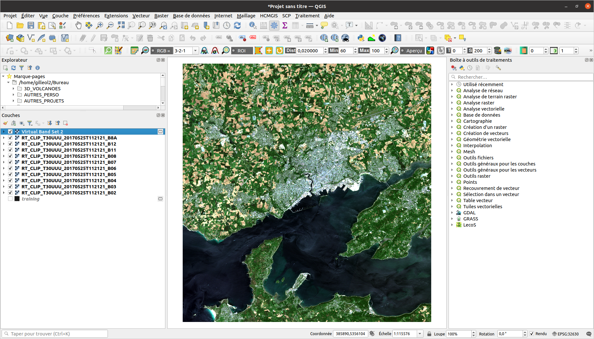

### 3 - Réaliser l'échantillon pour diriger la classification

1 - Vous devez vectoriser votre échantillon (méthode manuelle ou automatique).  

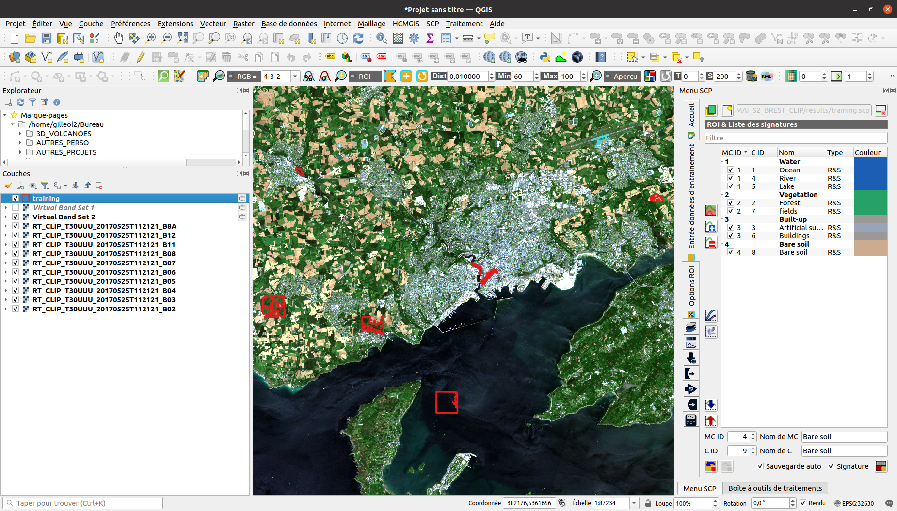

2 - Ensuite, vérifiez la variance inter-classe, la distance entre chaque classe.  

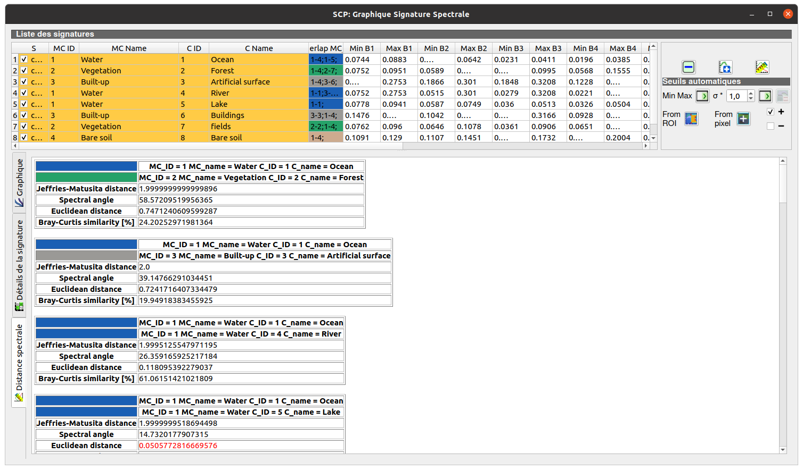

2 - Puis, prévisualisez votre classification avec l'outil dédié.  

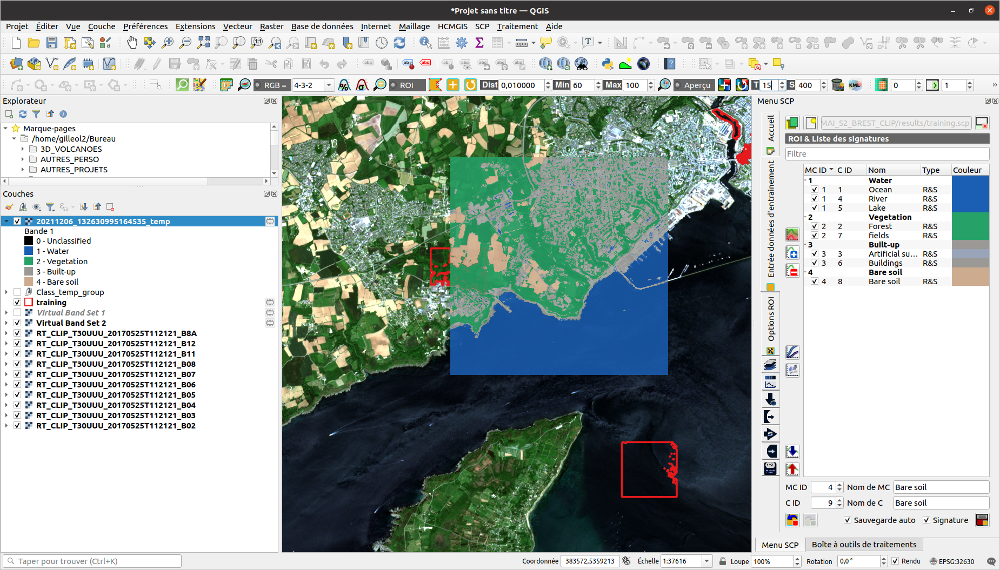

### 4 - Classifier votre image satellitaire

> SCP -> Traitement de bande -> Classification


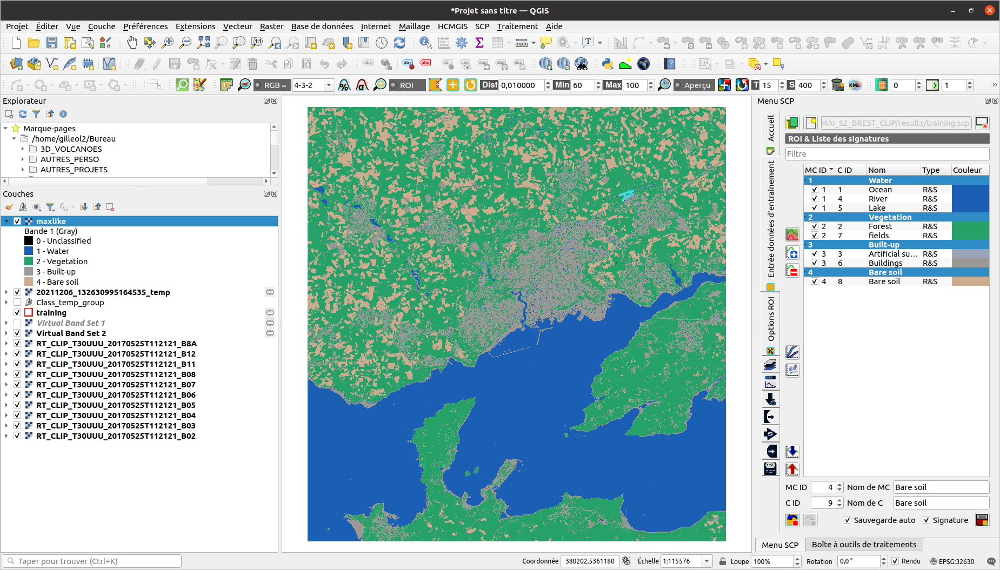

Après exécution de votre algorithme de classification, vous pouvez appliquer un filtre pour modifier la valeur des pixels isolés pour la valeur dominante de son voisinage, un filtre majoritaire. Les filtres "passe-bas" agissent en atténuant/adoucissant les contrastes (Réduit donc le bruit, réduit donc les pixels isolés). A l'inverse, les filtres "passe-haut" renforcent/améliorent les contrastes. 

# **`r emo::ji("warning")`Filtre majoritaire - CM Mme Vaguet**  

**Objectif** = enlever les pixels isolés   
  - Dans un raster, cette méthode permet de changer la valeur d’un pixel en fonction de la valeur des pixels voisins.     
  - Dans une fenêtre 3x3, on peut considérer 2 types de voisinage :     
    **« 4 voisins les plus proches »** ou **« 8 voisins les plus proches » ** (choix de l’opérateur).   
  - Une fois le filtre appliqué, la cellule centrale prend la valeur la plus représentée parmi les cellules voisines.   
  - Cette valeur doit être représentée dans la moitié ou la majorité des cellules voisines (choix de l’opérateur).   

> SCP -> Post-traitement -> Cribler la classification

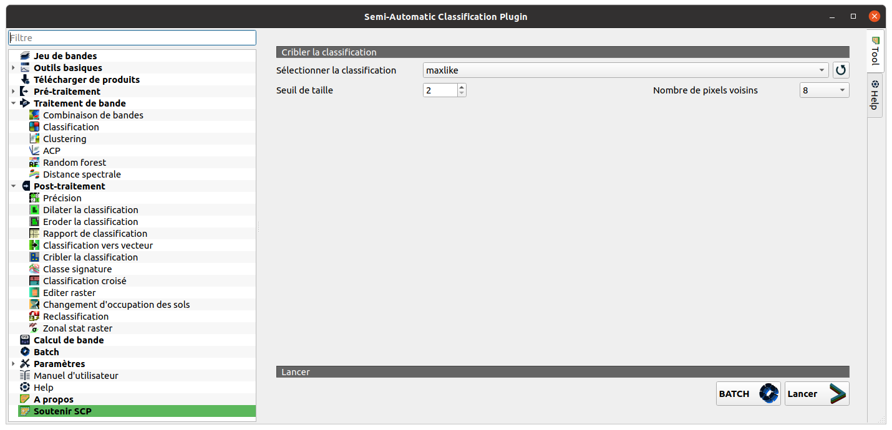


### 5 - Valider votre classification

Pour terminer, vous devez votre valider classification avec un autre échantillon. Pour rappel, l'opérateur doit disposer de deux jeux de données issus de la vectorisation des zones d'entraînement. Le premier jeu de données est utilisé pour réaliser la classification alors que le second permet de valider ou non la classification. On distingue deux types de validation : 
- **L'évaluation qualitative** ou interprétation visuelle des résultats. C'est une comparaison visuelle entre le résultat et d'autres données comme des photographies aériennes ... 
- **L'évaluation quantitative** mesure de manière très précise l'écart obtenu entre l'échantillon de validation et de classification. Une matrice de confusion ainsi qu'un indice de Kappa peuvent alors être générés pour évaluer la classification. 

> SCP -> Post-traitement -> Précision

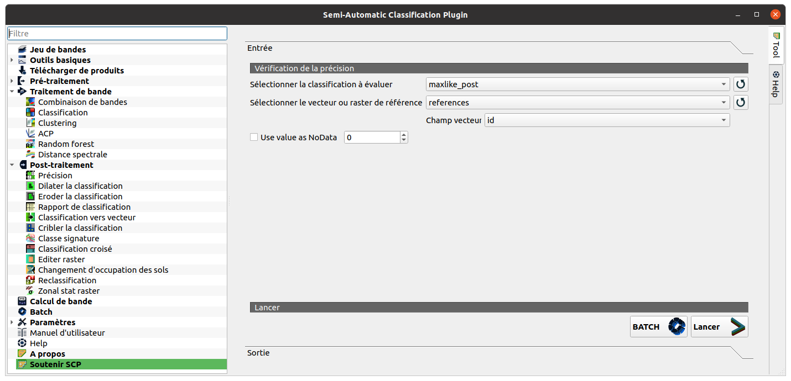  

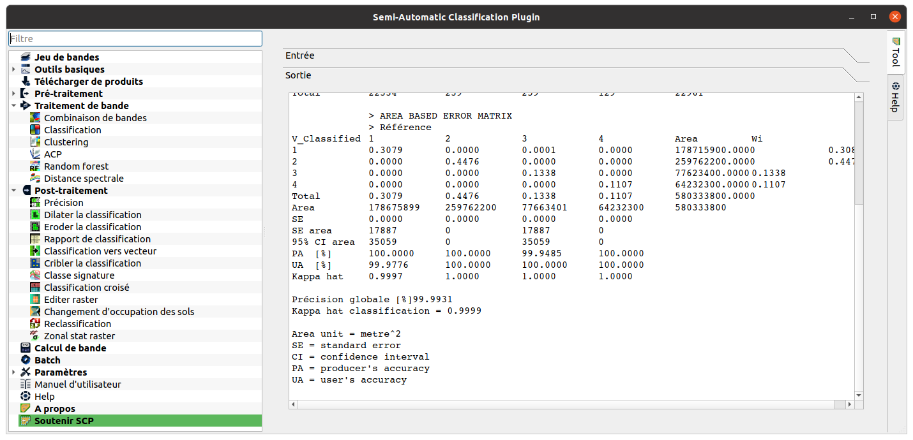 

### 6 - Calcul de la superficie des espaces végétalisés par commune 

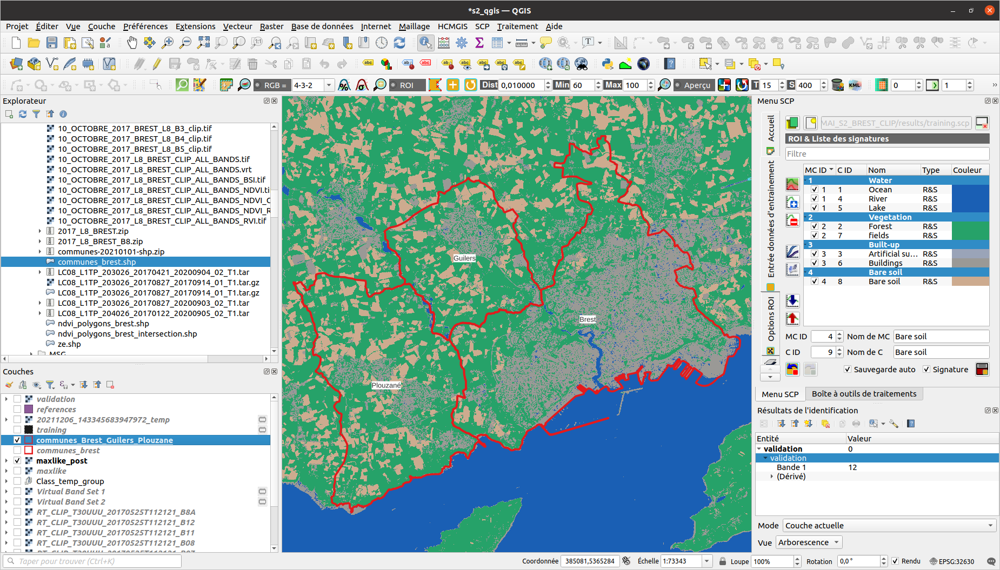 

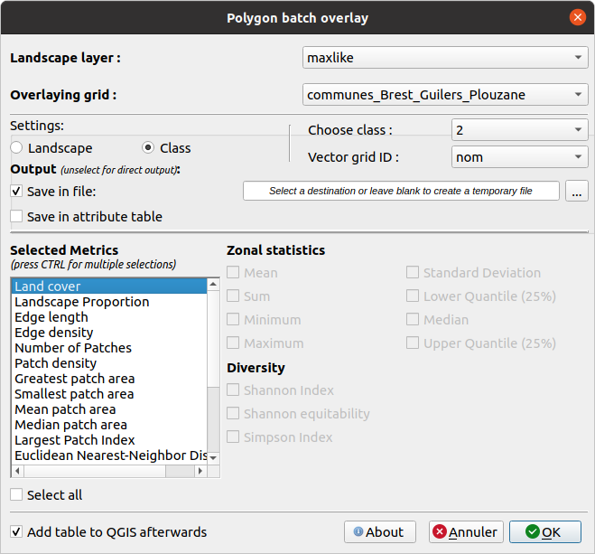 

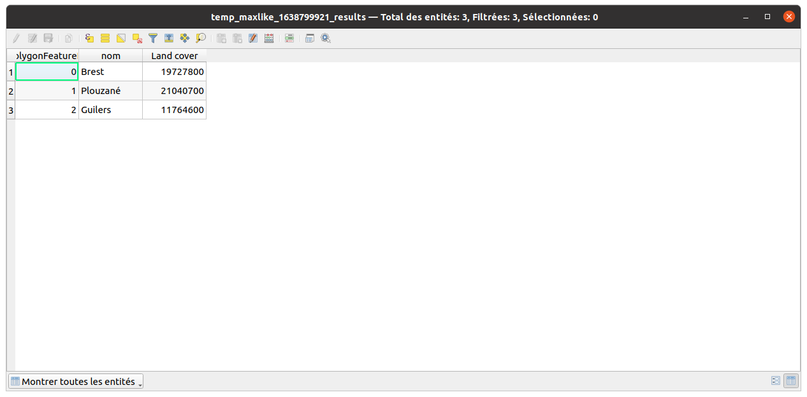 

`r emo::ji("stats")` Voici un exemple de résultat attendu  

<center>
```{r echo=FALSE, message=FALSE, warning=FALSE, , echo=FALSE}
results <- data.frame(communes=c('Brest','Guilers','Plouzané'),superficie=c(19727800,21040700,11764600)/1000000)
p <- ggplot2::ggplot(results, ggplot2::aes(x=communes, y=superficie, fill=communes)) +
  ggplot2::geom_bar(stat="identity")+
  ggplot2::labs(title = "Superficie des espaces végétalisés par commune",subtitle = "10 octobre 2017 - Algorithme Kmeans", x="Commune", y="km2")+ 
  ggplot2::theme_minimal() +
  ggplot2::theme(axis.text.x = ggplot2::element_blank())+
  ggplot2::scale_fill_brewer(palette="Dark2")
print(p)
```
</center>